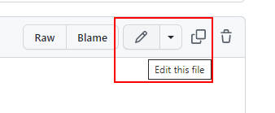
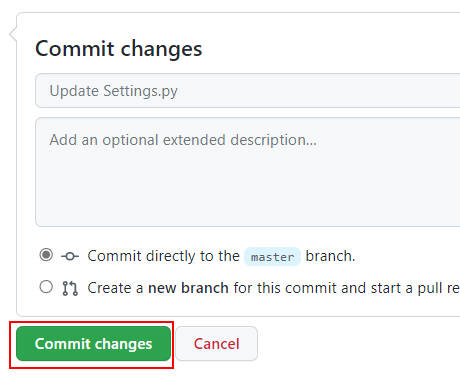
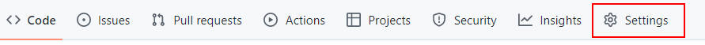
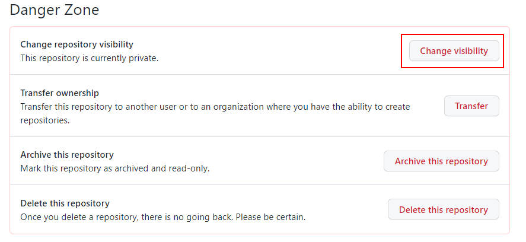
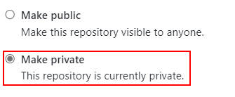

# Xidian Daily Up

Auto fill in XDU daily up.

## Advantages

With the help of **Github Actions**, you don't need to have a local environment or server. All the work is scheduled to be done automatically. The only thing you need is just a Github account.

## Usage

1. Register a Github account.
2. **Fork** this repository.
    
3. Open `Settings.py`, click the "Edit" button, then update your information. Once completed, commit the changes.
    
    
4. Enjoy your day! 

## Warning!

Make sure the repository is **private** since the file `Settings.py` contains your studentID and password.

1. 

2. 

3. 

## Disclaimer

The author doesn't take any responsibility for your use of this script.